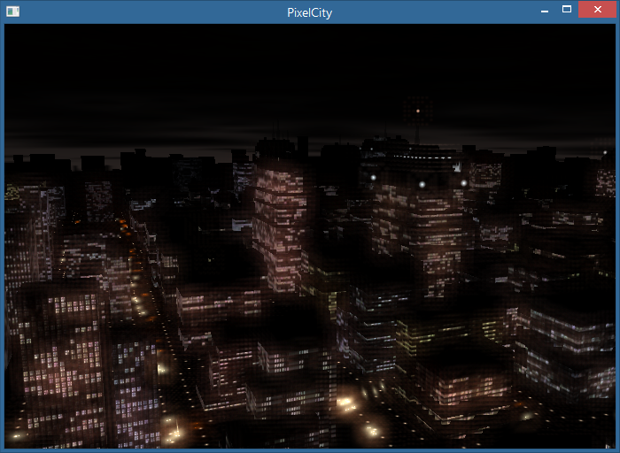

# PixelCity

*A screenshot of the PixelCity program.*

This is a fork of Shamus Young's [Pixel City](http://www.shamusyoung.com/twentysidedtale/?p=2940)
project, a procedurally generated nighttime city. It has been forked from
[fluffyfreak's repository](https://github.com/fluffyfreak/pixelcity), which
modified the original to compile in Visual Studio 2012.
